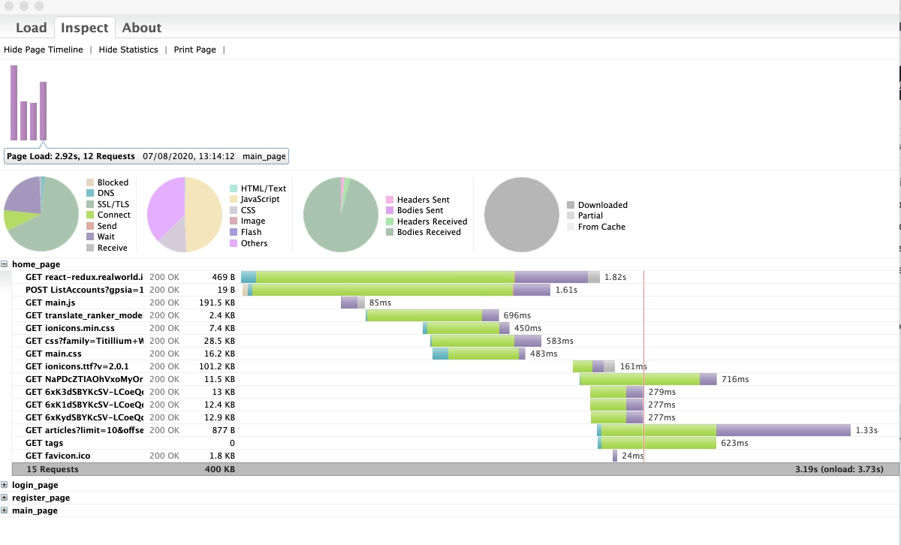

# Use Proxy for UI performance tests with Selenium(Selenide)

## Using Native Selenide Proxy:
``` 
    @BeforeEach
    public void setUpTest(){
        Configuration.browser = "chrome";
        Configuration.baseUrl = "https://react-redux.realworld.io";
        Configuration.startMaximized = true;
        Configuration.proxyEnabled = true;
        open();
    }

    @AfterEach
    public void tearDownTest(){
        getWebDriver().close();
    }

    @ParameterizedTest
    @CsvSource({
            "main_page, /#/, a[href='#login']",
            "login_page, /#/login, button[type='submit']",
            "register_page, /#/register, button[type='submit']"
    
    })
    @Tag("load_selenide")
    public void verifyAllPages(String pageName, String pageUrl, String selector) throws IOException {
        Configuration.pageLoadStrategy = "normal";
    
        getSelenideProxy().getProxy().newHar(pageName);
    
        open(pageUrl);
        $(selector).shouldBe(visible);
    
        Har har = getSelenideProxy().getProxy().endHar();
        HarWriter.writeHAR(new File("hars/" + pageName + ".har"), har.getLog());
        HarPage page = har.getLog().getPages().stream().filter(p -> p.getTitle().equals(pageName)).collect(Collectors.toCollection(ArrayList::new)).get(0);
        assertAll(()->{
            assertTrue(page.getPageTimings().getOnLoad() < 5000, "Load time should be less than 5000 ms");
            assertTrue(page.getPageTimings().getOnLoad() > 0, "Load time should be more than 0 ms");
        });
    
    }

```

### 2. Using Browse Mob Proxy:
``` 
    public static BrowserMobProxy bmp;

    @BeforeAll
    public static void setUp() {
        bmp = new BrowserMobProxyServer();
        bmp.setTrustAllServers(true);
        bmp.setHarCaptureTypes(CaptureType.getAllContentCaptureTypes());
        bmp.setHarCaptureTypes(CaptureType.getHeaderCaptureTypes());
        bmp.start(4444);

        //Configuration.baseUrl = "http://google.com";
        //Configuration.pageLoadStrategy = "normal";
    }

    @AfterAll
    public static void tearDown() throws IOException {
        bmp.stop();
    }


    @BeforeEach
    public void setUpTest(){
        Proxy seleniumProxy = ClientUtil.createSeleniumProxy(bmp);

        DesiredCapabilities desiredCapabilities = new DesiredCapabilities();
        desiredCapabilities.setCapability(CapabilityType.PROXY, seleniumProxy);

        Configuration.baseUrl = "http://google.com";
        Configuration.pageLoadStrategy = "normal";
        Configuration.browserCapabilities = desiredCapabilities;
    }


    @AfterEach
    public void tearDownTest(){
        Selenide.closeWindow();
    }


    @Test
    public void shouldOpenLoginPage() throws IOException {
        bmp.newHar("google");
        
        open("/");
        
        Har har = bmp.endHar();
        har.writeTo(new File("hars/google.har"));
        HarPage page = har.getLog().getPages().get(0);
        assertAll(()->{
            assertTrue(page.getPageTimings().getOnLoad() < 5000, "Load time should be less than 5000 ms");
            assertTrue(page.getPageTimings().getOnLoad() > 0, "Load time should be more than 0 ms");
        });
    }

```

### 3. Watch detailed requests statistics with HAR [viewer]("https://chrome.google.com/webstore/detail/http-archive-viewer/ebbdbdmhegaoooipfnjikefdpeoaidml?hl=ru"): 



